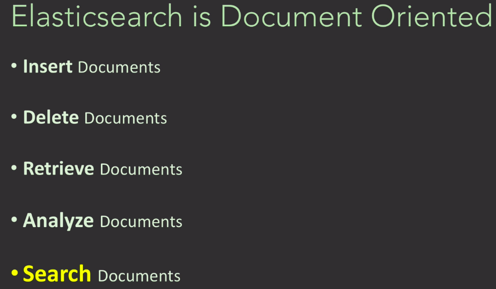
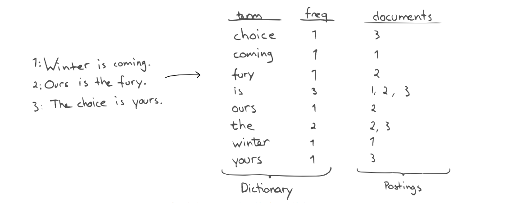
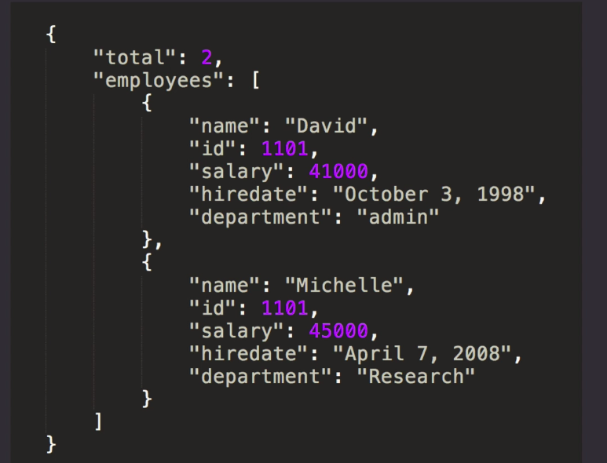
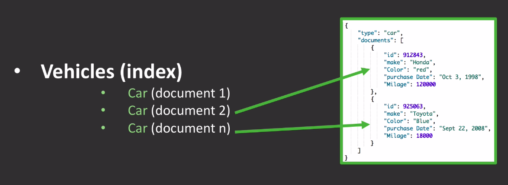
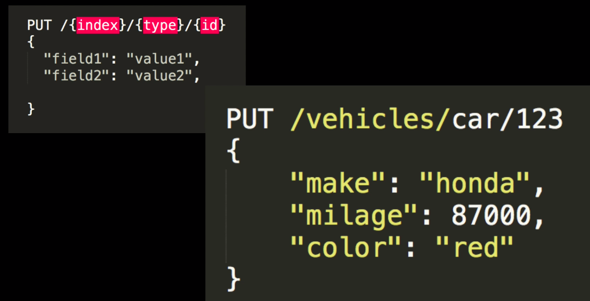

[Elasticsearch Overview](#Elasticsearch-Overview) 

[Creating an Inverted Index](#Creating-an-inverted-index)

[Elasticsearch Documents](#Elasticsearch-Documents)

[Indexing, Retrieving and Deleting Documents](#Indexing,-Retrieving-and-Deleting-Documents)

[Dev Console](#Dev-Console)

[Using GET Method](#Using-GET-Method)

[Using HEAD Method](#Using-HEAD-Method)

[Using PUT Method](#Using-PUT-Method)

[Using UPDATE API](#Using-UPDATE-API)

[Using DELETE Method](#Using-DELETE-Method)

[Components of an Index](#Components-of-an-Index)

[Term Query](#Term-Query)

[Match All Query](#Match-All-Query)

[Mapping Date Formats](#Mapping-Date-Formats)

[Retrieve Data from Index by Date Range](#Retrieve-Data-from-Index-by-Date-Range)

[Multi get mget API](#Multi-get-mget-API)

[Index Settings and Mapping](#Index-Settings-and-Mapping)

[Adding dynamic property to index](#Adding-dynamic-property-to-index)

[Understanding Analyzer](#Understanding-Analyzer)

[Search DSL Query Context](#Search-DSL-Query-Context)

[Query Context](#Query-Context)


# Elasticsearch Overview




- The Primary aim of elasticsearch is to **search** for documents.
- Elasticsearch is like a search engine. they retrive documents at realtime.
- Searching is very fast in elasticsearch.
- Elasticsearch uses a data structure called an inverted index that supports very fast full-text searches. 
- An inverted index lists every unique word that appears in any document and identifies all of the documents each word occurs in.

### ElasticSearch Console
[Elasticsearch_Console_Link](http://localhost:5601/app/dev_tools#/console?load_from=https:/www.elastic.co/guide/en/elasticsearch/reference/current/snippets/1957.console
)

[Elasticsearch console](http://localhost:5601/app/dev_tools#/console)

# Create an Inverted Index

- To create an inverted index, we first split the content field of each document into separate words.
- Create a sorted list of all the unique terms.
- Then list the documents in which each term occurs.
- The result looks like this:




# Elasticsearch Documents

Elasticsearch documents are stored in a JSON format.



Here employees array contains 2 documents.

Documents also contain reserved fields that constitute the document metadata such as:

- **_index** – the index where the document resides
- **_type** – the type that the document represents
- **_id** – the unique identifier for the document


An Example of a document:

```json
{
   "_id": 3,
   "_type": [“your index type”],
   "_index": [“your index name”],
   "_source":{
   "age": 28,
   "name": ["daniel”],
   "year":1989,
  }
}
```

# Indexing, Retrieving and Deleting Documents

- In Elasticsearch, data is stored in to **index**.

- Consider an example of vehicle index. In this index, we can store vehicle documents.

- We store documents to **index**.

- Each **key:value** pair in documents is a **field**.




1. First, Here we created a vehicle index.
2. Stored multiple Car documents to vehicle index.

- In Elasticsearch, inserting a data is called **indexing**.

 
## Indexing Document

Syntax for indexing a document.



**Terminologies**

- **PUT** is the HTTP method used to index a document.
- **index** is the name of the index.
- **type** is the type of the document.
- **id** is the unique identifier for the document.
- With in curly braces, we provide the fields.

Time: 6: 30

lecture: https://www.udemy.com/course/complete-elasticsearch-masterclass-with-kibana-and-logstash/learn/lecture/7283502#overview

# Dev Console 

```console
PUT /vehicles/_doc/1
{
  "make": "honda",
  "milage": 8722,
  "color": "red"
}
```

vehicles - index name,

_doc - document type,

1 - document id

- json part is the document we gave to elasticsearch.

- Fields starting underscore are **meta fields**.
eg: _idnex, _type, _id, _shards 

- **_version** field gets updated each time we run the same query.

**Success Message after creating index**:

```json
{
  "_index" : "vehicles",
  "_type" : "_doc",
  "_id" : "1",
  "_version" : 3,
  "result" : "created",
  "_shards" : {
    "total" : 2,
    "successful" : 1,
    "failed" : 0
  },
  "_seq_no" : 2,
  "_primary_term" : 1
}
```

# Using GET Method

```bash
GET /vehicles/_doc/1
```

Retrive document with id 1.

```bash
GET /vehicles/_doc/2
```

Retrieve document with id 2.

Result will look like this:

```json
{
  "_index" : "vehicles",
  "_type" : "_doc",
  "_id" : "2",
  "_version" : 1,
  "_seq_no" : 6,
  "_primary_term" : 19,
  "found" : true,
  "_source" : {
    "make" : "yamaha",
    "milage" : 234,
    "color" : "black"
  }
}
```

here **_source** field contains the document.

To get only **_source** field as output, we can use the following query:

```bash
GET /vehicles/_doc/2/_source
```

Here we get the document without the meta fields.

# Using HEAD Method

To check the existence of document, we use HEAD method.

```bash
HEAD /vehicles/_doc/1
```

- If document exist, we will get a 200 status code.
- if documnet does not exist, we will get a 404 status code.

# Using PUT method

To update the document, we use the PUT method.

GET /vehicles/_doc/1

```bash
"_source" : {
    "make" : "honda",
    "milage" : 8722,
    "color" : "red"
  }
```

We have to update milage field of document with id 1.

```bash
PUT /vehicles/_doc/1
{
  "make": "honda",
  "milage": 6000,
  "color": "red"
}
```

- When we update using PUT method, it not only update that specific field, but the entire document.
- It is different from databases where we can update specific fields only.
- Here we are re indexing the document means inserting a new document with the udpated fields.

We get the following response after updating the document:

```json
{
  "_index" : "vehicles",
  "_type" : "_doc",
  "_id" : "1",
  "_version" : 7,
  "result" : "updated",
  "_shards" : {
    "total" : 2,
    "successful" : 1,
    "failed" : 0
  }
```

- **_version** field gets updated each time we run the same query.
- **result** field tells us whether the document is updated or not.

This how updating documents in elasticsearch works.


# Using UPDATE API

```bash
POST vehicles/_doc/1/_update
{
  "doc":
  {
    "milage": 8900
  }
}
```

- Use **_update** API to update the document.
- Use **POST** method to update the document.
- Field that needed to be updated is specified in the **doc** field.
- We can update multiple fields at a time.
- Here also we are fully reindexing the document and not just updating the fields.

```bash
POST vehicles/_doc/2/_update
{
  "doc":{
    "make": "hero",
    "color": "red"
  }
}
```

Result will look like this:

```bash
{
  "_index" : "vehicles",
  "_type" : "_doc",
  "_id" : "2",
  "_version" : 2,
  "result" : "updated",
  "_shards" : {
    "total" : 2,
    "successful" : 1,
    "failed" : 0
  }
```

- We can also insert new fields in the document.

```bash
POST vehicles/_doc/2/_update
{
  "doc":{
    "total_price": 780000
  }
}
```

- Inserted **total_price** field to the document with id 2. 

## Verify the changes in the document:


```bash
GET vehicles/_doc/2
```

- Result will look like this:

```bash
{
  "_index" : "vehicles",
  "_type" : "_doc",
  "_id" : "2",
  "_version" : 3,
  "_seq_no" : 11,
  "_primary_term" : 20,
  "found" : true,
  "_source" : {
    "make" : "hero",
    "milage" : 234,
    "color" : "red",
    "total_price" : 780000
  }
}
```

# Using DELETE Method

```bash
DELETE vehicles/_doc/2
```

- Here document with id 2 is deleted from index vehicles.

- Result will look like this:

```bash
{
  "_index" : "vehicles",
  "_type" : "_doc",
  "_id" : "2",
  "_version" : 4,
  "result" : "deleted",
  "_shards" : {
    "total" : 2,
    "successful" : 1,
    "failed" : 0
  }
```

- Verify the document is deleted.

```bash
GET vehicles/_doc/2
```


- Result will look like this:

```bash
{
  "_index" : "vehicles",
  "_type" : "_doc",
  "_id" : "2",
  "found" : false
}
```

## Delete index using DELETE method

```BASH
DELETE vehicles/
```

Result will look like this:

```JSON
{
  "acknowledged" : true
}
```

# Components of an Index

## Create Index

Create index named *business* with type as *building*.

```bash
PUT /business/building/100
{
  "address": "56 New Dover",
  "floors": 10,
  "office": 21,
  "loc":{
    "lat": 60.8726378,
    "lon": 89.2198372
  }
}
```

### Get Structure of index

```bash
GET /business/
```

### Add another document to the index

```bash
PUT business/building/134
{
  "address": "89 New Dover",
  "floors": 11,
  "office": 90,
  "price": 7921.90,
  "loc":{
    "lat": 10.8726378,
    "lon": 49.2198372
  }
}
```

- This time we add another field **price** to the document.


### Add a document with different type to same index.

```bash
PUT /business/employee/344
{
  "name": "Jesse Ander",
  "title": "Accountant",
  "salary": 70000,
  "hiredate": "Jan 20, 2021"
}
```

- Shows exeception when we try to add another document with different type to same index.
- Since business index has type as building, we can not add another document with type as employee.
- We have to create new index with type as employee.
- An index can support only one type.

### Create Employee Index

```bash
PUT /employee/_doc/344
{
  "name": "Jesse Ander",
  "title": "Accountant",
  "salary": 70000,
  "hiredate": "Jan 20, 2021"
}
```

**Index:** employee

**Type:** _doc


## Search for Documents using _Search API

- We can search for business index and documents in it.

```bash
GET /business/_search/
```

Response will look like this:

```bash
  "hits" : {
    "total" : {
      "value" : 2,
      "relation" : "eq"
    },
    "max_score" : 1.0,
    "hits" : [
      {
        "_index" : "business",
        "_type" : "building",
        "_id" : "100",
        "_score" : 1.0,
        "_source" : {
          "address" : "56 New Dover",
          "floors" : 10,
          "office" : 21,
          "loc" : {
            "lat" : 60.8726378,
            "lon" : 89.2198372
          }
        }
      },
      {
        "_index" : "business",
        "_type" : "building",
        "_id" : "134",
        "_score" : 1.0,
        "_source" : {
          "address" : "89 New Dover",
          "floors" : 11,
          "office" : 90,
          "price" : 7921.9,
          "loc" : {
            "lat" : 10.8726378,
            "lon" : 49.2198372
          }
        }
      }
    ]
  }
}
```

- Here Documents are present in *hits.hits* array.

# Term Query

To search for a document matching a specific field.

```bash
GET /business/_search/
{
  "query": {
    "term": {
        "floors": 10
    }
  }
}
```

- Above query will search for documents with **floors** field equal to 10 and returns matching document.


**Example - 2**

```bash
GET /employee-api/_search/
{
  "query": {
    "term": {
      "role": "Developer"
    }
  }
}
```

- Above query will search for documents with **role** field equal to Developer and returns matching document.

# Match All Query

Returns every documents inside an index.

```bash
GET /employee-api/_search/
{
  "query": {
    "match_all": {}
  }
}
```

- **match-all** query returns every documents inside **employee-api** index.


**Example 2**

```bash
GET /employee/_search/
{
  "query": {
    "match_all": {}
  }
}
```


- **match-all** query returns every documents inside **employee** index.


# Mapping Date Formats

- Create an index where we give type to each fields. For date field, we input *type* and *format*.

```bash
  PUT purcharse-index
  {
    "mappings": {
      "properties": {
        "productId": {
          "type": "integer"
        },
        "name": {
          "type": "text"
        },
        "price": {
          "type": "float"
        },
        "purchaseDate": {
          "type": "date",
          "format": "yyyy-MM-dd"
        }
      }
    }
  }
```

### Get Data from Index

```bash
GET purcharse-index/_search
```

# Retrieve Data from Index by Date Range

- We pass date range in query. Set **lte** and **gte** property to set the start and end date.

```bash
GET /purcharse-index/_search
{
  "query": {
    "range": {
      "purchaseDate": {
        "gte": "2021-09-01",
        "lte": "2022-10-01"
      }
    }
  }
}
```

# Multi get (mget) API

- Retrieves multiple JSON documents by ID.
- Pass **index** and **id** property
```bash
GET /_mget
{
  "docs": [
    {
      "_index": "purcharse-index",
      "_id": 2
    },
    {
      "_index": "purcharse-index",
      "_id": 3
    }     
  ]
}
```

# Index Settings and Mapping

- Create new index with settings and mappings properties.

```bash
PUT customer
{
  "settings": {
    "number_of_shards": 2,
    "number_of_replicas": 1
  },
  "mappings": {}
}
```

- Define mapping for each field. We pass types and format of each field. We again use **PUT** method here. We specify **properties**. Inside **properties**, we specify the **fields**.

```bash
PUT /customer
{
  "mappings": {
    "properties": {
      "gender": {
        "type": "text",
        "analyzer": "standard"
      },
      "age": {
        "type": "integer"
      },
      "total_spent": {
        "type": "float"
      },
      "is_new": {
        "type": "boolean"
      },
      "name": {
        "type": "text",
        "analyzer": "standard"
      }
    }
  },
  "settings": {
    "number_of_shards": 2,
    "number_of_replicas": 1
  }
}
```

- *online* is the name of mapping.
- Inside *properties*, we specify the *fields*.
- *gender*, *age*, *total_spent*, *is_new* and *name* are the fields.

### Analyzer Property of a Field
**standard analyzer** splits the text on whitespace, lowercases it and removes non-alphanumeric characters.

Example:

```bash
"gender": {
  "type": "text",
  "analyzer": "standard"
}
```

### Get Document

```bash
GET customer/_search
```

### Insert a document to customer index.

```bash
PUT customer/_doc/1
{
  "gender": "male",
  "age": 22,
  "total_spent": 4000,
  "is_new": false,
  "name": "Imtiaz"
}
```

# Adding dynamic property to index.

Set dynamic property to mapping.

**dynamic**:

If set to **false** - Indexing field will be ignored. I.e. if we set **dynamic** to **false**, then we can't add new fields to index.

If set to **strict** - Indexing field will throw error. I.e. if we set **dynamic** to **strict**, then while adding a new field error is thrown to user.

To set dynamic propety to mapping we use PUT method. Pass dynamic property in **mappings**.

```bash
PUT customer
{
  "mappings": {
    "dynamic": "strict",
    "properties": {
        "online": {
          "properties": {
            "gender": {
              "type": "text",
              "analyzer": "standard"
            },
            "age": {
              "type": "integer"
            },
            "total_spent": {
              "type": "float"
            },
            "is_new": {
              "type": "boolean"
            },
            "name": {
              "type": "text",
              "analyzer": "standard"
            }
        }
      }
    }
  },
  "settings": {
    "number_of_shards": 2,
    "number_of_replicas": 1
  }
}
```

# Understanding Analyzer

## Whitespace Analyzer
```bash
POST _analyze
{
  "analyzer": "whitespace",
  "text": "The quick brown fox is here"
}
```

**Result :**

```bash
{
  "tokens" : [
    {
      "token" : "The",
      "start_offset" : 0,
      "end_offset" : 3,
      "type" : "word",
      "position" : 0
    },
    {
      "token" : "quick",
      "start_offset" : 4,
      "end_offset" : 9,
      "type" : "word",
      "position" : 1
    },
    {
      "token" : "brown",
      "start_offset" : 10,
      "end_offset" : 15,
      "type" : "word",
      "position" : 2
    },
    {
      "token" : "fox",
      "start_offset" : 16,
      "end_offset" : 19,
      "type" : "word",
      "position" : 3
    },
    {
      "token" : "is",
      "start_offset" : 20,
      "end_offset" : 22,
      "type" : "word",
      "position" : 4
    },
    {
      "token" : "here",
      "start_offset" : 23,
      "end_offset" : 27,
      "type" : "word",
      "position" : 5
    }
  ]
}
```

Here we can observe that text contents are broken up in to tokens based on the **whitespace** analyzer.


## Standard Analyzer

```bash
POST _analyze
{
  "analyzer": "standard",
  "text": "The quick brown fox is here"
}
```

**Result :**

```bash
{
  "tokens" : [
    {
      "token" : "the",
      "start_offset" : 0,
      "end_offset" : 3,
      "type" : "<ALPHANUM>",
      "position" : 0
    },
    {
      "token" : "quick",
      "start_offset" : 4,
      "end_offset" : 9,
      "type" : "<ALPHANUM>",
      "position" : 1
    },
    {
      "token" : "brown",
      "start_offset" : 10,
      "end_offset" : 15,
      "type" : "<ALPHANUM>",
      "position" : 2
    },
    {
      "token" : "fox",
      "start_offset" : 16,
      "end_offset" : 19,
      "type" : "<ALPHANUM>",
      "position" : 3
    },
    {
      "token" : "is",
      "start_offset" : 20,
      "end_offset" : 22,
      "type" : "<ALPHANUM>",
      "position" : 4
    },
    {
      "token" : "here",
      "start_offset" : 23,
      "end_offset" : 27,
      "type" : "<ALPHANUM>",
      "position" : 5
    }
  ]
}
```

Here we can observe that text contents are broken up in to tokens, also words are converted to lowercase by using **standard** analyzer.

## Simple Analyzer

Time: 9: 00

The **simple analyzer** breaks text into tokens at any non-letter character, such as numbers, spaces, hyphens and apostrophes, discards non-letter characters, and changes uppercase to lowercase.

```bash
POST _analyze
{
  "analyzer": "simple",
  "text": "The 2 QUICK Brown-Foxes jumped over the lazy dog's box."
}
```


**Result :**

```bash
{
  "tokens" : [
    {
      "token" : "the",
      "start_offset" : 0,
      "end_offset" : 3,
      "type" : "word",
      "position" : 0
    },
    {
      "token" : "quick",
      "start_offset" : 6,
      "end_offset" : 11,
      "type" : "word",
      "position" : 1
    },
    {
      "token" : "brown",
      "start_offset" : 12,
      "end_offset" : 17,
      "type" : "word",
      "position" : 2
    },
    {
      "token" : "foxes",
      "start_offset" : 18,
      "end_offset" : 23,
      "type" : "word",
      "position" : 3
    },
    {
      "token" : "jumped",
      "start_offset" : 24,
      "end_offset" : 30,
      "type" : "word",
      "position" : 4
    },
    {
      "token" : "over",
      "start_offset" : 31,
      "end_offset" : 35,
      "type" : "word",
      "position" : 5
    },
    {
      "token" : "the",
      "start_offset" : 36,
      "end_offset" : 39,
      "type" : "word",
      "position" : 6
    },
    {
      "token" : "lazy",
      "start_offset" : 40,
      "end_offset" : 44,
      "type" : "word",
      "position" : 7
    },
    {
      "token" : "dog",
      "start_offset" : 45,
      "end_offset" : 48,
      "type" : "word",
      "position" : 8
    },
    {
      "token" : "s",
      "start_offset" : 49,
      "end_offset" : 50,
      "type" : "word",
      "position" : 9
    },
    {
      "token" : "box",
      "start_offset" : 51,
      "end_offset" : 54,
      "type" : "word",
      "position" : 10
    }
  ]
}
```

# Search DSL Query Context

**DSL** - Domain Specific Language

Create *course* index with type *classroom*.
A sample index is given below:

```bash
PUT /courses/classroom/4
{
    "name": "Computer Science 101",
    "room": "C12",
    "professor": {
        "name": "Gregg Payne",
        "department": "engineering",
        "facutly_type": "full-time",
        "email": "payneg@onuni.com"
        },
    "students_enrolled": 33,
    "course_publish_date": "2013-08-27",
    "course_description": "CS 101 is a first year computer science introduction teaching fundamental data structures and alogirthms using python. "
}
```

## Search DSL Components

**Query Context:**

  This is used for full text searches. 

**Filter Context:**

  This is used for filtering the results.


# Query Context

## Match All Query

Returns all documents in the index.

```bash
GET courses/_search
{
  "query": {
    "match_all": {}
  }
}
```

## Match Query

Returns the documents that match the query. Here it returns the documents having name field as *computer*.

```bash
GET courses/_search
{
  "query": {
    "match": {
      "name": "computer"
    }
  }
}
```

Returns the documents with department of professor as *engineering*.

```bash 
GET courses/_search
{
  "query": {
    "match": {
      "professor.department": "engineering"
    }
  }
}
```

## Match Multiple Queries

Returns the documents that matches bpth match query. For example, if want to get documents which having fields name as *computer* and department as *engineering*.

We couple *must* array with *match* query in this case. Later we dump this *must* list into *bool* array.

**Console:**

```bash
GET courses/_search
{
  "query": {
    "bool": {
      "must": [
        {"match": {
          "name": "computer"
        }},
        {"match": {
          "room": "c8"
        }}
      ]
    }
  }
}
```

Here we return the documents from **courses** index which having fields name as *computer* and room as *c8*.


